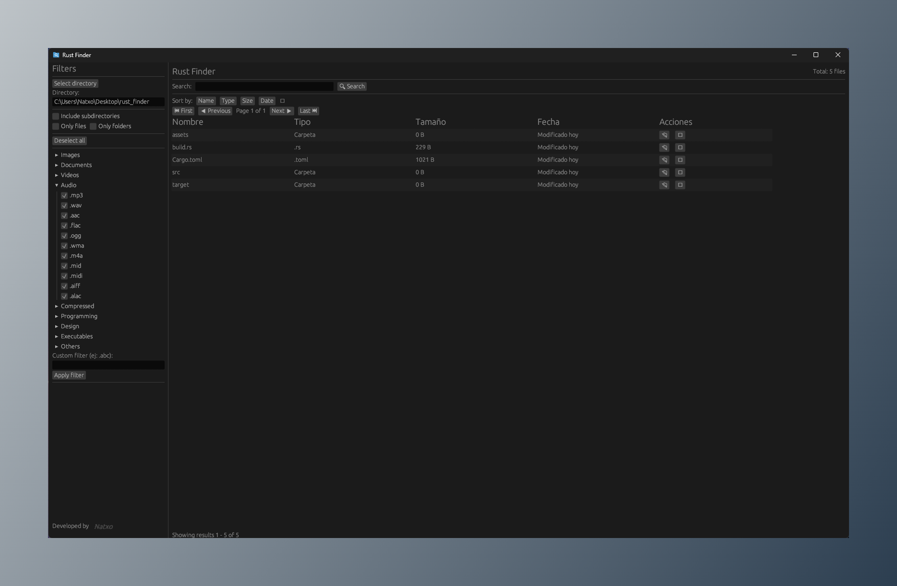

# 🔍 Rust Finder

## 📝 Description
Rust Finder is a powerful and customizable file searching application built entirely in Rust. The application allows users to search for files and folders with advanced filtering options and a modern GUI.

---

## ✨ Features

### 🖥️ User Interface
- **Modern GUI**: Built using `eframe` for a responsive and clean interface.
- **Sidebar Filters**:
  - 📂 Select a base directory using a native dialog.
  - 🔄 Include or exclude subdirectories from the search.
  - 🏷️ Filter by specific file types (e.g., `.png`, `.jpg`, `.txt`).
  - 🎛️ Enable or disable global file type filters.
  - ➕ Add custom extensions manually.
  - 📁 Toggle between "Only files" or "Only folders".
- **Search Bar**:
  - 🔎 Input search terms to narrow down results.
  - ⚡ Instant search activation with a button or pressing `Enter`.

### 📊 Results Table
- Display results in a table with the following columns:
  - File Name
  - Type (File or Folder)
  - Size (Formatted to KB, MB, etc.)
  - Last Modified Date
- **Action Buttons**:
  - Open the directory of a file or folder.
  - Copy the path to the clipboard.
- **Pagination**: 
  - Navigate through results in pages of 100 results. (Made for performance reasons)
- **Sorting**: Short results by:
  - **Name**: Alphabetically (A-Z or Z-A).
  - **Size**: Ascending or descending.
  - **Date**: Oldest to newest or newest to oldest.
  - **Type**: Group by file or folder types.

### 🎯 Filters
- **Default Filters**: Grouped by type, all extensions are selectable individually:
  - 🖼️ **Images**: `.jpg`, `.jpeg`, `.png`, `.gif`, `.bmp`, `.tiff`, `.webp`, `.svg`, `.ico`, `.raw`, `.psd`, `.ai`, `.heic`
  - 📄 **Documents**: `.pdf`, `.doc`, `.docx`, `.txt`, `.rtf`, `.odt`, `.xls`, `.xlsx`, `.csv`, `.ods`, `.ppt`, `.pptx`, `.odp`, `.pages`, `.numbers`, `.key`, `.epub`, `.mobi`
  - 🎥 **Videos**: `.mp4`, `.avi`, `.mkv`, `.mov`, `.wmv`, `.flv`, `.webm`, `.m4v`, `.mpg`, `.mpeg`, `.3gp`, `.vob`
  - 🎵 **Audio**: `.mp3`, `.wav`, `.aac`, `.flac`, `.ogg`, `.wma`, `.m4a`, `.mid`, `.midi`, `.aiff`, `.alac`
  - 📦 **Compressed**: `.zip`, `.rar`, `.7z`, `.tar`, `.gz`, `.bz2`, `.xz`, `.iso`
  - 💻 **Programming**: `.py`, `.js`, `.html`, `.css`, `.cpp`, `.c`, `.h`, `.java`, `.rs`, `.php`, `.rb`, `.swift`, `.go`, `.sql`, `.json`, `.xml`, `.yml`, `.yaml`, `.toml`
  - 🎨 **Design**: `.sketch`, `.fig`, `.xd`, `.ai`, `.eps`, `.indd`, `.blend`, `.fbx`, `.obj`, `.stl`
  - ⚙️ **Executables**: `.exe`, `.msi`, `.app`, `.dmg`, `.deb`, `.rpm`, `.apk`, `.bat`, `.sh`
  - 📎 **Others**: `.log`, `.cfg`, `.ini`, `.dat`, `.bak`, `.tmp`, `.db`, `.sqlite`
- **Custom Extensions**: Users can add additional file extensions manually.
- **Global Toggle**: Option to enable or disable all file type filters.

### 🚀 Search Engine
- Recursively browse through directories and subdirectories.
- Apply filters dynamically to limit results by type or extension.
- Handle file metadata to display size and modification dates.

### 🛠️ Utilities
- **Clipboard Management**: Copy file paths to the system clipboard.
- **File Metadata Helpers**:
  - Retrieve human-readable file sizes.
  - Fetch last modified dates in a user-friendly format.

---

## 🚀 Getting Started

### ⬇️ Download
1. Go to the [Releases](https://github.com/Natxo09/rust_finder/releases) page.
2. Download the latest version for your platform (Windows, Linux, or macOS).

### 💿 Installation
1. Extract the downloaded archive if necessary.
2. Run the executable file to start the application.

---

## 📖 Usage
1. Launch the application.
2. Use the sidebar to select a directory and apply filters.
3. Enter search terms in the search bar and press `Enter` or click "Search".
4. View results in the table and interact using the action buttons.

---

## 🤝 Contributing
Contributions are welcome! Please fork the repository and submit a pull request for review.

---

## 📄 License
This project is licensed under the MIT License.
